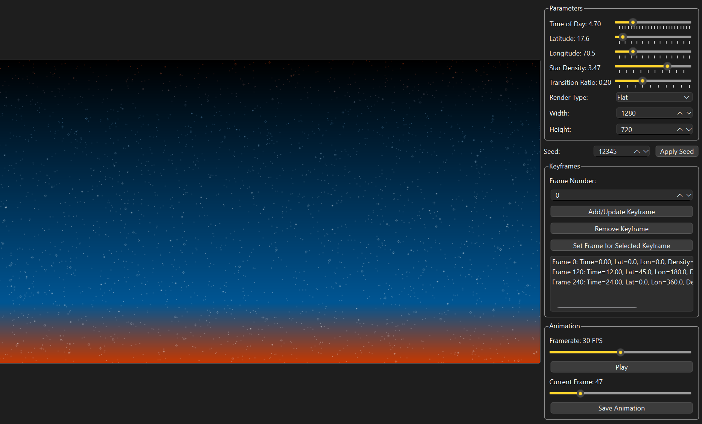

# Twilight Wallpaper Generator

A dynamic wallpaper generation tool that creates beautiful twilight scenes with customizable parameters and animation capabilities.

## Features

- Real-time preview of generated twilight scenes
- Interactive parameter controls:
  - Time of Day
  - Latitude/Longitude
  - Star Density
  - Transition Effects
  - Render Type (Flat/Spherical)
- Keyframe-based animation system
- Adjustable framerate (1-60 FPS)
- Custom seed support for reproducible results
- Set output resolution

## Interface

The application features a split interface with:
- Left panel: Real-time preview of the generated wallpaper
- Right panel: Control parameters, keyframe management, and animation controls

## Animation System

- Create keyframes at specific points in time
- Smooth interpolation between keyframe states
- Play/pause controls
- Frame scrubbing
- Adjustable framerate

### Multi-threaded Architecture
The animation system uses a multi-threaded design:

- **Animation Thread**
  - Calculates next animation state at target framerate
  - Handles timing and interpolation between keyframes
  - Maintains consistent animation pacing

- **Generator Thread** 
  - Handles image generation and rendering independently
  - Works asynchronously from animation timing
  - Enables frame dropping when needed

This separation enables smooth animation playback by allowing the system to maintain correct timing even when image generation takes longer than the frame interval. If rendering can't keep up with the target framerate, frames are naturally dropped while preserving proper animation timing.

## Usage

1. Adjust the parameters using the sliders to create your desired twilight scene
2. Set keyframes at different points to create an animation sequence
3. Use the animation controls to preview your sequence
4. Play the animation to see smooth transitions between states

## Requirements

- Python 3.10.9+
- PySide6
- Pillow (PIL)

## Upcoming Features

- Visual improvements to render output
- Set Timeline In and Out points
- Save sequence as image series or video

## Credits

Original concept and creation by Howard Look.
Based on the implementation by [bcaluneo/Twilight](https://github.com/bcaluneo/Twilight).